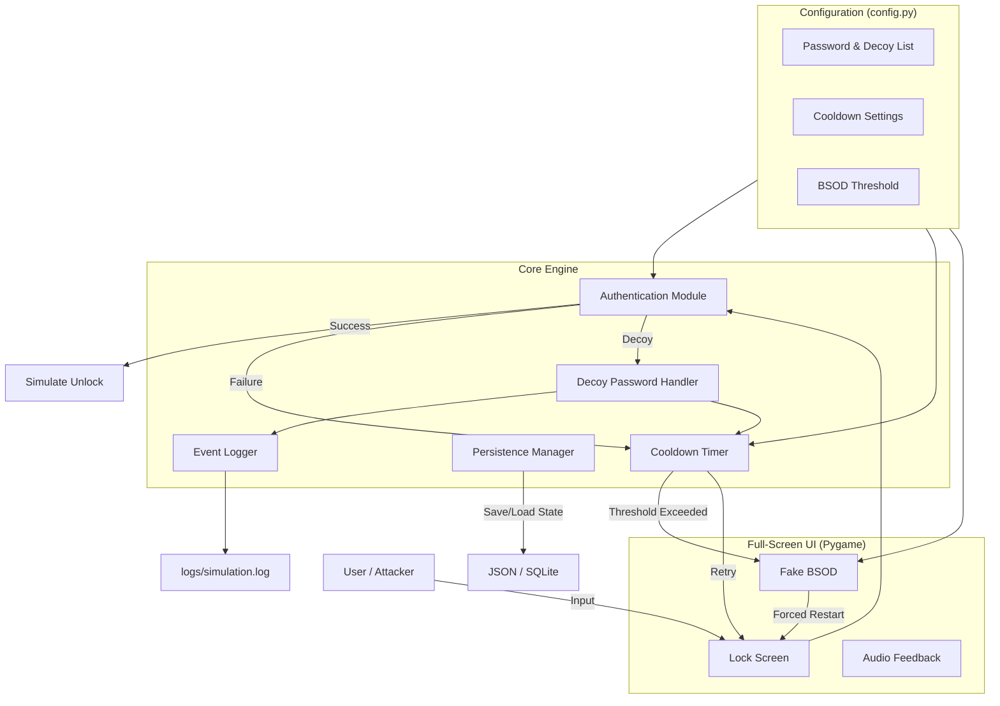

# Encryption Behavior Simulation Lab

An **educational simulation lab** that demonstrates cryptographic defense mechanisms, including password‑based encryption, decoy key injection, rate‑limiting cooldowns, biometric mock‑ups, tamper‑response triggers, anti‑forensics persistence, and event logging – all within a full‑screen Windows‑style lock screen environment.

---

## Description

The **Encryption Behavior Simulation Lab** is a controlled, isolated environment designed for studying how encryption‑enabled systems behave under various attack and defense scenarios. It simulates:

- **Password‑based encryption** with multiple verification layers.
- **Decoy passwords** (honeypot keys) that trigger logging and countermeasures.
- **Biometric authentication** mock‑ups (fingerprint, face ID) for multi‑factor simulation.
- **Cooldown timers** to emulate rate‑limiting and lockout policies.
- **Fake BSOD** (Blue Screen of Death) as a tamper‑response mechanism.
- **Persistence hooks** that simulate anti‑forensics and system resilience.
- **Comprehensive logging** of all authentication attempts for post‑event analysis.
- **Optional audio feedback** to enhance situational awareness.

> ⚠️ **Important:** This lab is strictly for educational purposes and must be run inside an isolated virtual machine. Never deploy it on production or personal systems.

---

## Features

| Feature | Description |
|---------|-------------|
| **Full‑Screen UI** | Immersive lock screen interface mimicking a Windows environment. |
| **Password Encryption Simulation** | Verifies entered passwords against a stored hash (bcrypt) to simulate cryptographic verification. |
| **Decoy Passwords** | Pre‑defined "honeypot" credentials that, when used, trigger logging and cooldown escalation. |
| **Biometric Mock‑ups** | Placeholder buttons for fingerprint and face recognition to demonstrate multi‑factor concepts. |
| **Cooldown Timer** | Progressive lockout period after failed attempts (configurable via `config.py`). |
| **Fake BSOD** | Simulated system crash when the cooldown timer expires or when a decoy password is repeatedly used. |
| **Persistence** | Demonstrates how a malicious actor might maintain access across reboots (registry‑like emulation). |
| **Logging** | All authentication events (success, failure, decoy usage, BSOD triggers) are logged to a file. |
| **Audio Feedback** | Optional sound cues for successful login, errors, and BSOD (requires `simpleaudio`). |
| **VM Detector** | Warns if the application is not running inside a VM – reinforces safe‑lab practices. |

---

## Tech Stack

- **Language**: Python 3.8+
- **GUI**: Pygame (for full‑screen rendering and event handling)
- **Cryptography**: bcrypt (password hashing), hashlib
- **Audio**: simpleaudio (optional)
- **Persistence**: JSON / SQLite (emulating registry / file system)
- **Logging**: Python’s built‑in `logging` module

---

## Architecture Overview



---

## Installation

### Prerequisites
- Python 3.8+
- pip
- Virtual machine (recommended: VirtualBox, VMware, or similar)

### Step‑by‑Step Setup

1. **Clone the repository**  
   ```bash
   git clone https://github.com/yourusername/Encryption-Behavior-Simulation-Lab.git
   cd Encryption-Behavior-Simulation-Lab
   ```

2. **Create a virtual environment**  
   ```bash
   python -m venv venv
   source venv/bin/activate   # On Windows: venv\Scripts\activate
   ```

3. **Install dependencies**  
   ```bash
   pip install -r requirements.txt
   ```

4. **Place the safety file**  
   The lab requires a file named `educational_simulation.txt` in the project root to confirm it is being used for legitimate study.  
   ```bash
   touch educational_simulation.txt   # or create manually
   ```

5. **Configure settings** (optional)  
   Edit `src/config.py` to change:
   - `PASSWORD` – the valid unlock password (hashed with bcrypt)
   - `DECOY_PASSWORDS` – list of decoy strings
   - `COOLDOWN_START`, `COOLDOWN_INCREMENT`, `COOLDOWN_MAX`
   - `BSOD_ATTEMPTS` – number of failed attempts before BSOD
   - `ENABLE_AUDIO` – set to `True` to enable sound effects (requires `simpleaudio`)

6. **Run the simulation**  
   ```bash
   python src/main.py
   ```
   The lock screen will launch in full‑screen mode. Press **ESC** at any time to exit safely.

---

## Usage

### Interaction
- **Password field**: Click inside the text area and type your password. Press **Enter** to attempt unlock.
- **Decoy passwords**: Enter one of the pre‑configured decoy strings (see `config.py`) to simulate a honeypot attempt.
- **Biometric buttons**: Click the fingerprint or face ID icons – they will produce a mock authentication result (configurable).
- **Cooldown**: After each failed attempt, the timer increases; during cooldown, the UI locks further input.
- **BSOD**: When the number of failed attempts exceeds the threshold, a simulated Blue Screen of Death appears. After a few seconds, the system will "reboot" (return to lock screen).

### Exiting
Press the **ESC** key to gracefully exit the simulation. All logs are saved.

---

## Project Structure

```
Encryption-Behavior-Simulation-Lab/
│
├── src/
│   ├── __init__.py
│   ├── main.py                # Entry point, initializes the simulation
│   ├── config.py              # All configurable parameters
│   ├── persistence_manager.py # Simulated registry / file persistence
│   ├── lock_screen.py         # Core lock screen UI and event loop
│   ├── bsod_manager.py        # Fake BSOD rendering and timing
│   ├── audio_manager.py       # Audio feedback (optional)
│   ├── vm_detector.py         # Checks if running inside a VM
│   └── logger.py              # Centralised logging
│
├── logs/                      # Generated log files
│   └── simulation.log
├── educational_simulation.txt # Safety bypass file (must exist)
├── requirements.txt
└── README.md                  # This file
```

---

## Configuration Parameters (`config.py`)

| Variable | Description | Default |
|----------|-------------|---------|
| `PASSWORD_HASH` | bcrypt hash of the correct unlock password | `b'...'` |
| `DECOY_PASSWORDS` | List of strings that act as honeypots | `['password123', 'admin']` |
| `COOLDOWN_START` | Initial cooldown seconds after first failure | `2` |
| `COOLDOWN_INCREMENT` | Extra seconds added per failure | `2` |
| `COOLDOWN_MAX` | Maximum cooldown before BSOD is triggered | `60` |
| `BSOD_ATTEMPTS` | Number of failures before BSOD | `5` |
| `ENABLE_AUDIO` | Enable/disable sound effects | `False` |
| `LOG_FILE` | Path to log file | `logs/simulation.log` |
| `VM_CHECK` | If `True`, warns when not in a VM | `True` |

---

## Security & Safety

- **Isolation requirement**: The lab **must** be run in a virtual machine to prevent accidental system changes and to safely test persistence and tamper‑response behaviours.
- **Safety bypass**: The file `educational_simulation.txt` must be present to confirm the user’s intent; otherwise, the simulator will exit with a warning.
- **No real system access**: All actions are contained within the simulation; no actual encryption keys or sensitive data are touched.
- **Logging**: All events are logged locally; no data is transmitted externally.

---

## Logging & Analysis

All authentication attempts are logged with timestamps, including:
- Successful unlocks
- Failed attempts (with the entered password masked)
- Decoy password usage
- Cooldown activation and expiry
- BSOD triggers and resets


---

## Testing

A basic test suite is provided in the `tests/` directory. To run:

```bash
python -m pytest tests/
```

Tests cover:
- Configuration loading
- Password verification (bcrypt)
- Cooldown timer logic
- Persistence read/write
- VM detection mock

---

## Future Improvements

- **Encryption algorithm simulation**: Add symmetric/asymmetric encryption demos (e.g., AES, RSA) alongside the lock screen.
- **Network activity logging**: Simulate external authentication attempts and response.
- **GUI customisation**: Support for different themes and lock screen styles.
- **Advanced persistence**: Simulate more sophisticated anti‑forensics techniques.
- **Multi‑user simulation**: Different users with separate encryption keys.

---

## License

This project is for **educational and research purposes only**.  
All rights reserved. Unauthorised use outside an isolated VM is discouraged.

---
